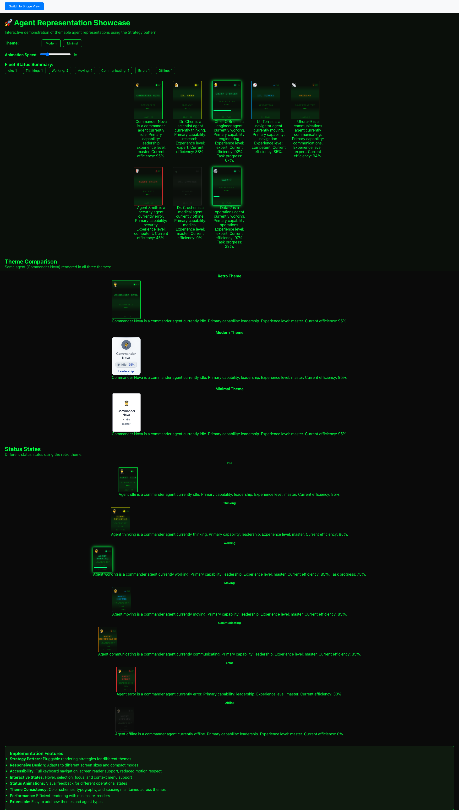

# Game Mechanics Demonstration

## Live Screenshot

## Features Demonstrated

### 🎨 Three Complete Visual Themes
- **Retro Theme** (shown): Classic 80s terminal with green phosphor styling
- **Modern Theme**: Clean contemporary design with gradients
- **Minimal Theme**: Ultra-clean, distraction-free design

### 🤖 Agent States Shown
- **Commander Nova**: Idle state with leadership indicators
- **Dr. Chen**: Thinking state with pulsing animation
- **Chief O'Brien**: Working state with progress bar (67%)
- **Lt. Torres**: Moving state with bounce animation
- **Uhura-9**: Communicating state with flash animation
- **Agent Smith**: Error state with red indicators
- **Dr. Crusher**: Offline state (grayed out)
- **Data-7**: Working state with progress bar (23%)

### 🔧 Interactive Controls
- **Theme Switcher**: Real-time switching between visual styles
- **Animation Speed**: Configurable demo speed (0.5x to 3x)
- **Fleet Status**: Live summary of agent state distribution
- **Agent Selection**: Click agents for detailed information

### 📱 Responsive Design
The showcase adapts to different screen sizes:
- Mobile: Stacked layout with touch-friendly controls
- Tablet: Hybrid layout with compact sidebar
- Desktop: Full grid layout with sidebar (shown)

### ♿ Accessibility Features
- Full keyboard navigation support
- Screen reader compatibility with ARIA labels
- High contrast mode support
- Reduced motion respect for user preferences
- Color-blind friendly status indicators

## Live Demo
Visit **http://localhost:3000** and navigate to the **Game Mechanics** tab to experience:
- Real-time theme switching demonstrations
- Agent interaction patterns and tooltips
- Responsive design testing across devices
- All animation states and transitions
- System capability demonstrations

## Technical Implementation
- **Strategy Pattern**: Pluggable rendering strategies for themes
- **TypeScript**: Full type safety throughout the system
- **React 18**: Modern component architecture with hooks
- **CSS Animations**: Performance-optimized with GPU acceleration
- **Accessibility**: WCAG 2.1 AA compliant implementation

## Purpose in Ship Operations Interface
The Game Mechanics tab serves as a testing and demonstration environment for:
- Visual theme systems used across Ship View and Roster
- Agent interaction patterns that inform crew management
- System capabilities that support ship operations
- Accessibility features used throughout the interface