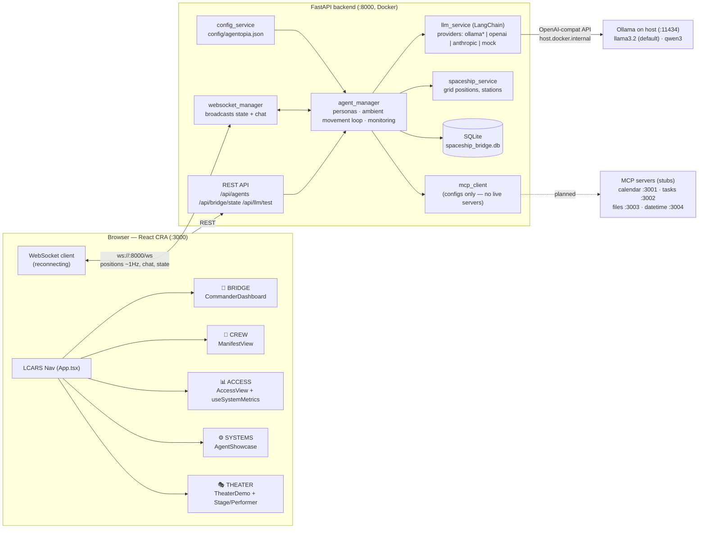
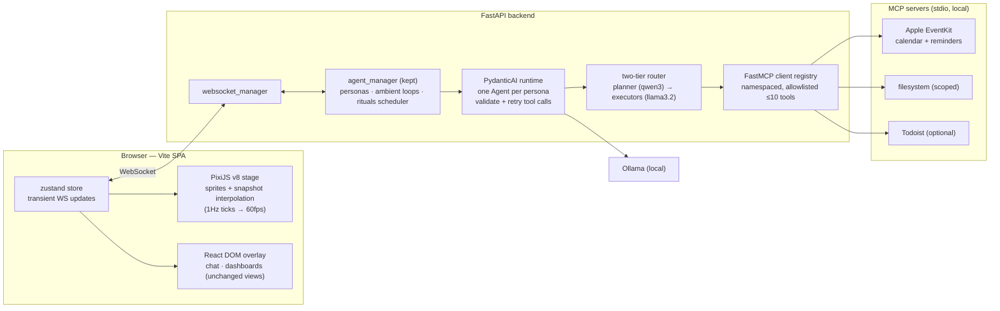

# Agentopia System Diagram

> **Living document.** Update this diagram in the same PR as any change that adds/removes a service, view, or integration. It is the shared spatial map for humans and agents — referenced from `CLAUDE.md` (agent context) and `README.md` (human context).
> Target-state decisions live in `openspec/changes/` (currently: `adopt-modern-agent-architecture`); when a change is archived, fold its boxes into the Current diagram here.

## Current system (as running)

`*` ollama is the default provider (`DEFAULT_LLM_PROVIDER`, docker-compose.yml).

## Target architecture (per `adopt-modern-agent-architecture` OpenSpec change)

## View → component map (quick agent reference)

| Tab | Component | Data source |
|-----|-----------|-------------|
| BRIDGE | `components/CommanderDashboard.tsx` | WS bridge state |
| CREW | `components/ManifestView.tsx` | static + WS |
| ACCESS | `components/AccessView.tsx`, `MetricDetailModal.tsx` | `hooks/useSystemMetrics.ts` |
| SYSTEMS | `AgentShowcase.tsx` | local demo state |
| THEATER | `TheaterDemo.tsx` + `components/Stage/Performer/Character` | local demo state |

Orphaned but improved (worldbuilding merge): `components/CharacterShowcase.tsx` — no tab renders it; candidate to fold into CREW or delete.
